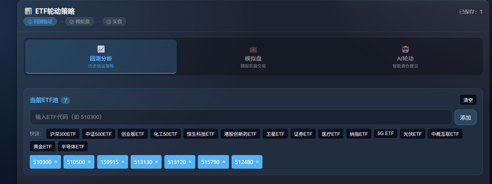
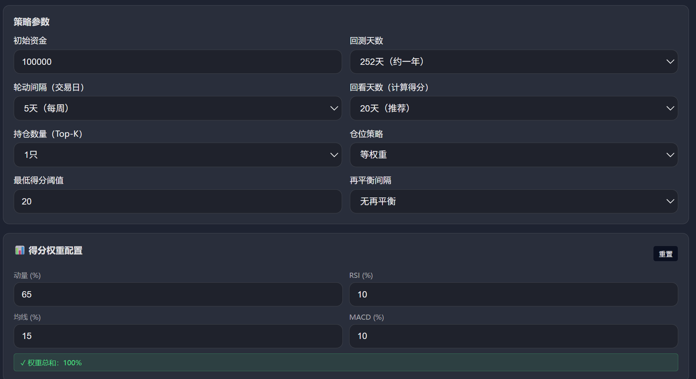
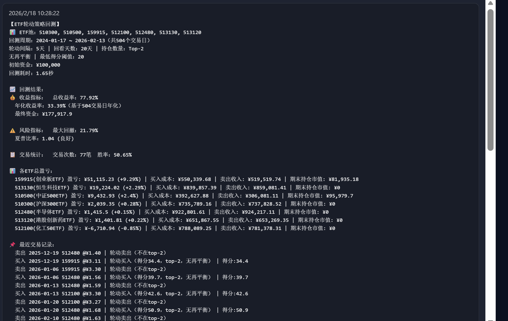
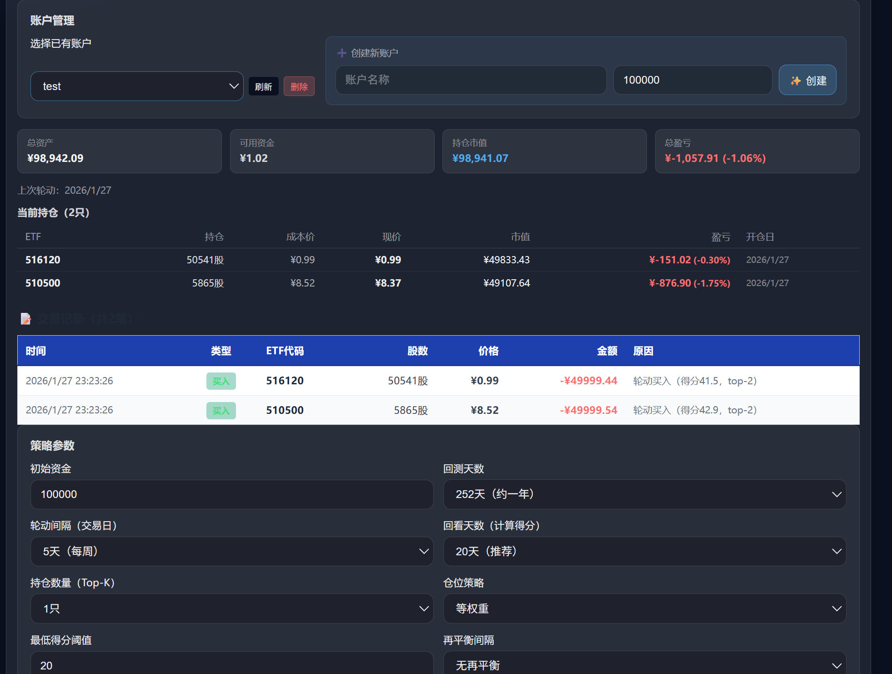

# ETF 轮动与模拟盘：使用说明

本文档介绍 **ETF 轮动回测、调仓建议、ETF 模拟盘与 AI 轮动** 的使用方法。策略与交易细节（仓位计算、轮动触发条件、交易顺序等）见 [etf_rotation_trading_logic.md](detail/etf_rotation_trading_logic.md)。

---

## 一、整体架构与工作流

### 1.1 架构概览

```
┌──────────────────────────────────────────────────────────────┐
│              ETF 轮动页（三种模式）                           │
│  回测分析 / 模拟盘 / AI轮动                                  │
└──────────────────────────────────────────────────────────────┘
       │                    │                      │
       ▼                    ▼                      ▼
┌───────────────┐   ┌────────────────┐   ┌────────────────────────┐
│ 回测流式进度  │   │ 模拟盘账户     │   │ AI分析 + 调仓建议      │
└───────────────┘   └────────────────┘   └────────────────────────┘
       │                    │                      │
       ▼                    ▼                      ▼
┌───────────────────────────────────────────────────────────────┐
│  系统：ETF 轮动策略回测、调仓建议、模拟盘账户与自动交易       │
└───────────────────────────────────────────────────────────────┘
```

- **本篇重点**：如何配置参数、运行回测、查看图表与调仓建议，以及如何使用 ETF 模拟盘。
- **算法与交易逻辑细节**：见 [etf_rotation_trading_logic.md](detail/etf_rotation_trading_logic.md)。

**策略应用流程**：典型流程为 **回测 → 模拟盘 → 实盘**。本模块提供**回测**与**模拟盘**功能（实盘需依赖其他系统或人工执行）。

- **回测的动机**：在**过去**一段时间内，用历史数据模拟交易，验证策略在历史上的表现。
- **模拟盘的动机**：在**未来**一段时间内，用实时或后续数据模拟交易，在真实资金介入前观察策略表现。

### 1.2 三种模式

- `backtest`：回测分析 — 配置 ETF 池与回测参数，运行流式回测，查看收益与调仓决策。
- `sim`：ETF 模拟盘 — 创建/选择账户，维护 ETF 池，执行自动调仓，查看持仓与交易记录。
- `ai`：AI 轮动 — 参数与得分权重由用户手动配置（含义与回测模式相同），AI 读取这些参数后对 ETF 池评分，并调用 LLM **自主决定最终持仓组合**。适合在回测前快速获取一次性调仓建议。

### 1.3 一般使用流程

1. **先配置 ETF 池**：在「回测分析」或「模拟盘」模式下，添加/删除 ETF 代码（顶部当前 ETF 池三者共用）。
2. **再选择后续操作**：运行**回测**在历史区间验证策略，或进入**模拟盘**创建账户并执行调仓；需要定性分析时可先使用 **AI 轮动** 再回测或模拟盘。

---

## 二、回测分析模式（mode = backtest）

### 2.1 ETF 池与快捷添加

- 顶部「当前 ETF 池」始终展示生效的 ETF 列表，可一键清空。
- 手动添加：
  - 在「添加 ETF 代码」输入框中键入代码（如 `510300`），按回车或点击「添加」；
- 快捷添加：系统提供默认 ETF 列表（如宽基、行业等），点击对应按钮即可将推荐 ETF 加入当前池。



### 2.2 回测参数配置

主要参数如下：

- **初始资金**：默认 100000；
- **回测天数**：60 / 126 / 252 / 504 / 756；
- **轮动间隔（交易日）**：
  - 1：每日轮动；
  - 5：周频轮动；
  - 10：两周轮动；
  - 20：月度轮动；
- **回看天数（lookback）**：
  - 10 / 20（推荐）/ 30 / 60；
  - 用于计算技术指标得分；
- **再平衡间隔**：
  - 空：无再平衡；
  - 指定天数：既有「ETF 轮动」也有「仓位再平衡」，详见策略逻辑文档；
- **最低得分阈值**：
  - 若所有 ETF 得分均低于阈值，则清仓不持仓；
- **持仓数量（Top-K）**：
  - 1～5 只 ETF，决定同一时刻最多同时持有的标的数量；
- **仓位策略**：
  - 等权重：各 ETF 资金占比相同；
  - 凯利公式：根据历史收益与波动计算最优仓位。

可以根据个人偏好先使用「无再平衡 + Top-1」做简单轮动，再尝试引入再平衡与多只持仓。



### 2.3 AI 增强与实时进度

- **使用 AI 分析**：打勾后，轮动时会调用 AI 对当前 ETF 池做额外分析；回测过程中会展示「AI 分析中」与「组合决策」等实时信息。
- **流式进度**：可看到当前已完成百分比、当前日期、已耗时等；支持「停止回测」，停止后返回已完成部分的局部结果。
- **实时决策摘要**：进度区下方会展示近若干条轮动/交易决策（Top-K 目标 ETF、买入/卖出指令与原因；若启用 AI 则显示 AI 分析摘要与得分）。

### 2.4 回测结果展示

回测完成后，会在历史列表中追加一条结果卡片，内容包括：

- 回测参数摘要（ETF 池、回测周期、轮动/再平衡/Top-K、阈值等）；
- 收益指标：总收益率、年化收益率、最终资金；
- 风险指标：最大回撤、夏普比率；
- 交易统计：总交易次数与胜率；
- 各 ETF 总盈亏与期末持仓价值；
- 最近若干笔交易的文本摘要；
- 可选：回测图表（失败时不显示）。



---

## 三、ETF 模拟盘模式（mode = sim）

### 3.1 模拟账户管理

- **创建账户**：输入账户 ID（如 `etf_sim_1`）与初始资金，点击「创建账户」。
- **选择账户**：下拉框中选择已有账户，可刷新或删除；删除账户会同时清空其 ETF 池与交易记录。


### 3.2 账户信息与持仓

选定账户后，会显示：

- 总资产与可用资金；
- 持仓市值与当前盈亏（金额 + 百分比）；
- 上次轮动日期 / 再平衡日期；
- 当前持仓表格：ETF 代码、持仓股数、成本价、现价、市值、盈亏；
- 最近交易记录（支持分页查看）。



### 3.3 ETF 池与自动调仓

- **账户 ETF 池**：
  - 账户层面有自己的 ETF 池；在模拟盘模式下添加/删除 ETF 会直接更新账户 ETF 池；
  - 移除 ETF 时，如账户持有该 ETF，会自动清仓。
- **自动调仓**：设置回看天数、Top-K、得分权重、轮动与再平衡间隔等参数后，点击「执行自动调仓」，系统会计算调仓建议、执行买卖并更新账户，并返回执行笔数与可能的提示信息。也可先「查看调仓建议」仅查看建议而不下单。

---

## 四、AI 轮动模式（mode = ai）

### 4.1 工作原理

**AI 仅负责调仓决策，不负责设置参数**。具体流程如下：

1. 用户手动配置所有参数（回看天数、Top-K、最低得分阈值、轮动/再平衡间隔、仓位策略）以及各技术指标的得分权重（动量 / RSI / 均线 / MACD）；
2. 系统根据上述参数对 ETF 池中每只标的计算技术指标得分；
3. AI（LLM）读取得分与行情数据，**自主决定最终推荐哪些 ETF 持仓**，并给出分析理由。

> 参数与权重的含义与「回测分析」模式完全相同，详见第二节。

### 4.2 使用步骤

1. 确认顶部 ETF 池已配置目标标的；
2. 在「策略参数」卡片中设置回看天数、Top-K、阈值等；
3. 在「得分权重配置」卡片中调整动量/RSI/均线/MACD 权重；
4. 点击「🤖 运行 AI 轮动分析」。

### 4.3 AI 轮动结果

若系统返回结构化结果，界面会显示：

- 最终推荐 ETF 列表（AI 决策结果，高亮展示）；
- 每只 ETF 的技术指标得分排名；
- 若有详细分析报告，则以长文本展示。

这一模式适合在做大规模回测前，通过 LLM 快速获取一次性调仓建议，辅助决策候选 ETF 集合。

---
