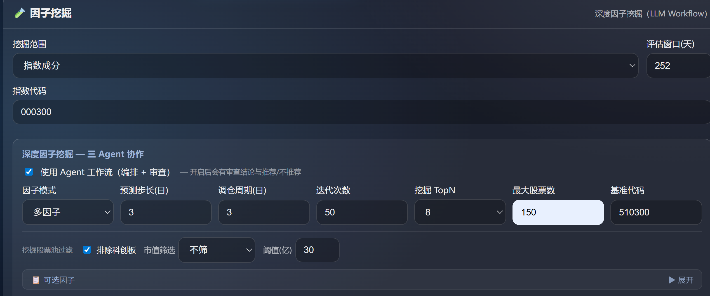
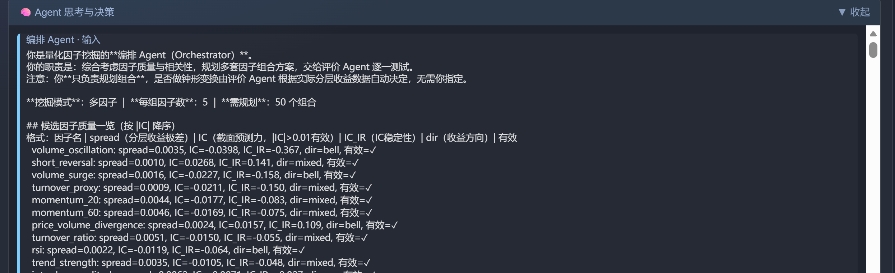
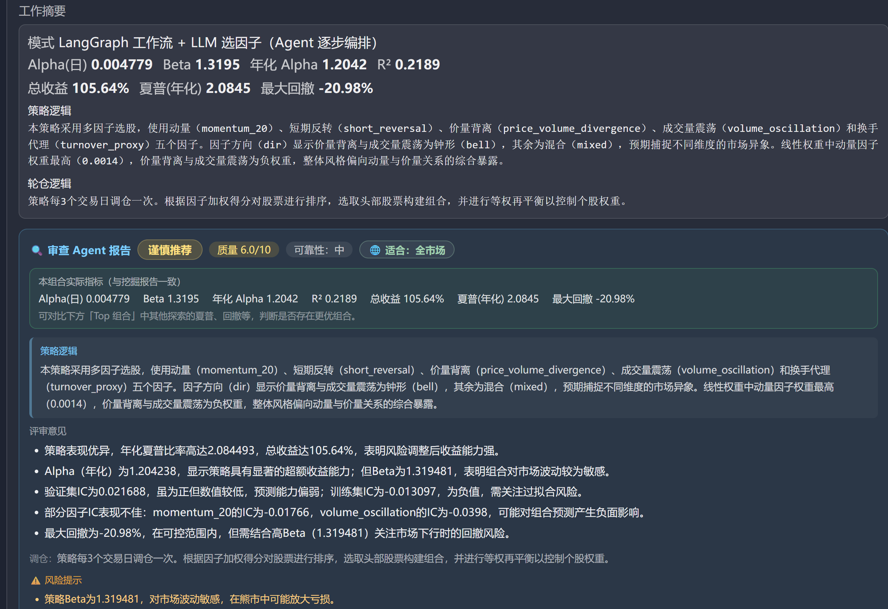
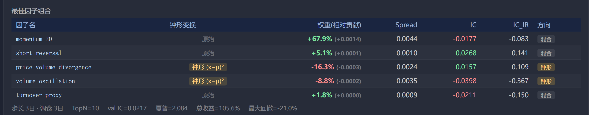
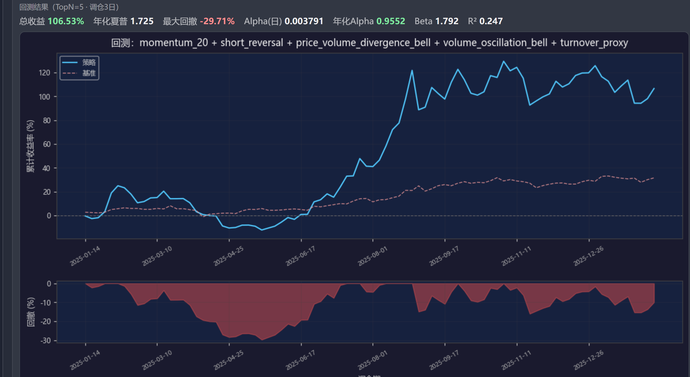
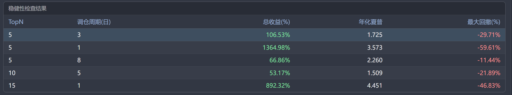

# 因子挖掘与回测：架构与使用说明

本文档说明系统中**因子挖掘**、**回测**与**数据存储**的架构、工作流及各部分逻辑，并给出一次完整的深度挖掘示例。

> **重要说明**：因子挖掘中的**回测结果未考虑滑点与手续费**。所得收益、夏普、回撤等指标为理论值，实盘需自行考虑交易成本。

---

## 一、整体架构与工作流

### 1.1 架构概览

```
┌─────────────────────────────────────────────────────────────────────────┐
│                    因子挖掘页（股票池配置、深度挖掘、回测、摘要）          │
│  股票池配置 │ 深度挖掘参数 │ 迭代次数/ TopN │ 回测参数 │ 个股权重 │ 摘要  │
└─────────────────────────────────────────────────────────────────────────┘
                    │                              │
                    ▼                              ▼
┌──────────────────────────────┐    ┌──────────────────────────────────────┐
│  factor-deep-search/start    │    │  factor-backtest/start + stream      │
│  + stream + stop             │    │  (加载数据 → 回测 → Alpha/Beta/图表)  │
└──────────────────────────────┘    └──────────────────────────────────────┘
                    │                              │
                    ▼                              ▼
┌─────────────────────────────────────────────────────────────────────────┐
│                         tools/deep_factor_search                         │
│  _run_agent_driven_search: 编排 Agent → 评价 Agent → 审查 Agent          │
│  run_factor_backtest_only:  解析股票池 → 构建/加载因子 → 回测 → 图表     │
└─────────────────────────────────────────────────────────────────────────┘
                    │                              │
        ┌───────────┼───────────┐                  │
        ▼           ▼           ▼                  ▼
┌─────────────┐ ┌─────────────┐ ┌─────────────┐ ┌─────────────────────────┐
│ 因子计算    │ │ 权重训练    │ │ 回测与评估  │ │ 数据与因子存储          │
│ factor_     │ │ factor_     │ │ factor_     │ │ db/manager +             │
│ definitions │ │ trainer     │ │ eval        │ │ db/factor_storage       │
│ + registry  │ │ (Ridge+网格)│ │ (IC/回测)   │ │ (SQLite)                 │
└─────────────┘ └─────────────┘ └─────────────┘ └─────────────────────────┘
```

- **挖掘**：由「编排 Agent」规划多组因子组合 → 「评价 Agent」对每组做钟形决策、线性权重训练、轻量回测 → 「审查 Agent」综合选出最优组合并生成策略/轮仓说明。
- **回测**：在选定因子组合与权重后，按调仓周期选 TopN、计算收益序列、与基准做 Alpha/Beta、生成收益曲线图；支持等权/按得分加权/凯利式个股权重。
- **存储**：行情数据存于 `stock_daily` 等表；因子值与远期收益存于 `factor_values`、`forward_returns`，构建样本时可先读库再补算，算完可写回。

### 1.2 深度挖掘工作流（三 Agent）

1. **加载数据**：按股票池（指数/行业/手动）拉取行情，构建或从库加载截面因子样本（含 `y`）。
2. **编排 Agent（LLM）**：根据因子质量（Spread、IC、方向）与相关性，规划若干组因子组合方案（数量由「迭代次数」等控制）。
3. **评价 Agent（代码）**：对每组组合：
   - 按分层收益判断是否做钟形变换；
   - 应用钟形后做**线性权重训练**（Ridge + lambda 网格优化）；
   - 轻量回测得到夏普等指标，供审查比较。
4. **审查 Agent（LLM）**：综合各 trial 结果，选出最优组合，输出策略逻辑、轮仓逻辑、风险提示等。
5. **输出**：最佳因子组合、学到的权重、回测统计、Alpha/Beta、策略与轮仓说明；可在界面中保存回测摘要。

### 1.3 Agent 工作流与普通工作流的区别（重要）

「深度因子挖掘」提供两种模式，需勾选 **「使用 Agent 工作流（编排 + 审查）」** 区分：

| 对比项 | **Agent 工作流**（勾选时） | **普通工作流**（不勾选时） |
|--------|----------------------------|----------------------------|
| **组合来源** | 由 **编排 Agent（LLM）** 根据因子质量与相关性规划多组因子组合，数量 = 用户设置的「迭代次数」（如 50）。 | 由 **代码枚举** 在因子表中按相关性等约束枚举若干组合，数量由「迭代次数」控制，上限 150。 |
| **评价方式** | **评价 Agent（代码）** 对每组做钟形决策、训练、轻量回测，得到夏普/Alpha/Beta 等；结果交给审查 Agent。 | 同一套「训练 + 回测」逻辑，逐组训练并比较夏普，**无** LLM 参与。 |
| **结论与报告** | **审查 Agent（LLM）** 综合所有 trial，给出 **推荐/谨慎推荐/不推荐**、质量分、策略逻辑、轮仓逻辑、风险提示；界面展示「审查结论」与「审查 Agent 报告」。 | **无** 审查 Agent，无推荐结论与策略/轮仓文字说明；仅输出最佳组合与数值指标。 |
| **Alpha/Beta** | 与基准（如 510300）对齐计算，结果写入每个 trial 及最终输出；**需正确加载基准行情** 才能非零。 | 同上，由工作流内回测与基准计算。 |
| **适用场景** | 希望由 LLM 做组合规划与质量结论、需要可解释的策略/风险说明时使用。 | 仅需快速枚举+自动选优、不需要审查报告时使用。 |

- **建议**：若需要「审查结论」与 Alpha/Beta 等完整输出，请**勾选「使用 Agent 工作流」**；若基准行情加载失败，Agent 工作流下 Alpha/Beta 可能为 0，需检查基准代码（如 510300/000300）与网络。

---

## 二、各部分说明

### 2.1 因子挖掘

- **入口**：因子挖掘页「深度因子挖掘 — 三 Agent 协作」区域。
- **模式选择**：务必区分 **Agent 工作流** 与 **普通工作流**（见上文 **1.3**）。勾选「使用 Agent 工作流」时走编排 + 评价 + 审查三 Agent，并输出审查结论与 Alpha/Beta；不勾选时仅为枚举组合 + 自动选优，无审查报告。
- **主要参数**：
  - 股票池：指数成分 / 分行业龙头 / 手动列表；
  - 因子模式：单因子 / 双因子 / 多因子；
  - 预测步长、调仓周期、**迭代次数**（训练轮数，Agent 下为组合方案数）、挖掘 TopN、最大股票数、**基准代码**（用于 Alpha/Beta，如 510300）等；
  - 过滤：排除科创板、市值范围（不筛/仅小市值/排除小市值）及阈值。
- **结果**：最佳因子组合表（因子名、钟形变换、权重、Spread、IC、IC_IR、方向）、回测统计、Alpha(日)/年化 Alpha/Beta/R²、策略逻辑与轮仓逻辑；**Agent 工作流**下另有审查报告（推荐/不推荐、质量分、风险提示）；支持「执行回测」与「保存摘要」。

### 2.2 回测

- **入口**：在得到最佳组合后，在同上页面使用「回测参数」与「执行回测」；API：`/pool/factor-backtest/start` + `/pool/factor-backtest/stream`（带进度）。
- **逻辑**：
  - 使用当前股票池与回测参数（TopN、调仓周期、回测天数、个股权重方式等）；
  - 若库中已有对应股票与日期范围的因子，则先**从库加载**，否则构建样本并**写回库**；
  - 按选定**个股权重**（等权 / 按得分加权 / 凯利）计算每期收益，得到收益序列；
  - 与基准对齐计算 Alpha、Beta、年化 Alpha、R²；生成收益曲线图与调仓明细。
- **个股权重**：
  - **等权**：每期持仓内个股收益简单平均；
  - **按得分加权**：权重 ∝ 综合得分（减最小值后归一）；
  - **凯利**：权重 ∝ max(y, 0)，y 为远期收益代理，归一化。

**参数鲁棒性与过拟合**：回测支持用与挖掘不同的 TopN、调仓周期、回测天数做**鲁棒性验证**。若仅小幅改动参数（如 TopN 10→5、调仓 1 日→8 日）就导致收益从大幅正收益变为大幅亏损，通常表示策略对参数或调仓周期较敏感，存在**过拟合**或对样本区间依赖过强。建议：先用「与挖掘一致」参数复现挖掘结果，再故意用多组参数对比收益区间，若多组参数下收益符号一致、量级可接受，则稳健性较好；若差异极大，应谨慎实盘并考虑简化组合或增加正则/样本外验证。

- **稳健性检查**：回测参数区提供「稳健性检查」勾选项。勾选后，在同一套数据上会用多组 (TopN, 调仓周期) 跑回测（如当前参数、5/1、5/8、10/5、15/1），结果区会多出一张「稳健性检查结果」表，列出每组的总收益(%)、年化夏普、最大回撤(%)；与当前回测参数一致的那一行会高亮。据此可快速判断策略是否对参数敏感、是否过拟合。

### 2.3 数据与因子存储

- **行情**：`db/manager.py`，SQLite 表 `stock_daily` / `stock_weekly` / `stock_monthly`（OHLCV），与 akshare 拉取结果一致时写入并支持周/月聚合。
- **因子**：`db/factor_storage.py`，同一 SQLite 库内：
  - **factor_values**：`(symbol, trade_date, factor_name, value)`，长表存储截面因子值；
  - **forward_returns**：`(symbol, trade_date, label_horizon, y)`，存储远期收益。
- **使用方式**：
  - 构建训练样本时，若库中已有相同股票、日期范围、因子名与步长的数据，则**优先从库加载**，不足再算并**写回**；
  - 查询接口：`GET /pool/factor-storage/names`（已存因子名）、`GET /pool/factor-storage/range`（日期范围）。

---

## 三、因子及其处理逻辑

### 3.1 因子来源与分类

- **注册表**：`modules/factor_mining/factor_registry.py`。因子分两大类：
  - **style（风格与估值）**：动量、趋势强度、低波动、PE、换手等；
  - **trading（情绪与交易）**：成交量突增、换手代理、短期反转、日内振幅、RSI、量价背离、高位成交、成交量震荡等。
- **计算**：`modules/factor_mining/factor_definitions.py` 中的 `build_factor_values(window, extra_factors)`，由 OHLCV 窗口与可选截面数据（如 PE、换手）得到各因子标量；样本构建时按 (date, stock_code) 逐行计算并得到截面表，列包含 `date`、`stock_code`、`y` 与各因子名。

### 3.2 权重训练（线性 Ridge + 网格优化）

- **模型**：线性组合 \( \hat{y} = X w \)，权重可正可负；训练目标为截面上的远期收益 `y`。
- **标准化**：按 `date` 截面做 z-score（减均值、除标准差），再按时序划分 train/val。
- **Ridge**：\( w = (X'X + \lambda I)^{-1} X'y \)。若提供 **lambda_grid**（如 `[1e-5, 1e-4, 1e-3]`），则在验证集上按 **val_rank_ic**（预测与 y 的秩相关）选最优 \(\lambda\)，并写回 `best_l2_lambda`；未提供网格时使用单一 `l2_lambda`。
- **输出**：`learned_weights.flat`（各因子权重）、`metrics`（train/val 相关、rank_ic、spread、best_l2_lambda）等，供回测与展示。

### 3.3 钟形变换

- **动机**：部分因子与收益呈「中间高、两端低」的倒 U 形，直接线性加权效果差；对因子做**钟形变换**后，中间值大、两端小，更符合这类关系。
- **实现**：`apply_bell_transforms(df, factor_names, date_col)`：按 `date` 截面求均值 \(\bar{x}\)，新增列 `{name}_bell = (x - \bar{x})^2`；训练与回测时使用 `*_bell` 列替代原列（若该因子被标记为钟形）。
- **何时使用**：由**分层收益**判断。对因子做分位数分层（如 5 档），计算各层平均远期收益；若**中间层收益明显高于两端**（`suggest_bell_from_quantile_returns` 为 True），则对该因子应用钟形变换；否则保持原始值。评价 Agent 在每组组合上按因子逐一定义是否钟形，再统一做变换与训练。

---

## 四、完整挖掘示例

以下是一次从参数设置到得到最佳组合与回测结果的完整流程（界面以「因子挖掘」页为主）。

### 4.1 步骤一：配置股票池与挖掘范围

1. **挖掘范围**：选择「指数成分」或「分行业龙头」或「手动股票池」；若选指数，填写指数代码（如 `000300`）；若选行业，勾选行业并设置每行业龙头数。
2. **评估窗口**：设置评估所用交易日天数（如 252）。
3. **因子模式**：选择「多因子」以允许多个因子组合。
4. **预测步长(日)**：如 5，表示用未来 5 日收益作为 `y`。
5. **调仓周期(日)**：如 1（每日）或 5（约周频）。
6. **迭代次数**：如 8，表示编排 Agent 规划约 8 组因子组合，评价 Agent 会逐组评估。
7. **挖掘 TopN**：如 10，表示每期选得分最高的 10 只股票。
8. **最大股票数、基准代码**：按需填写；可设置排除科创板、市值筛选等。

  

### 4.2 步骤二：启动深度搜索并查看进度

1. 点击「开始深度搜索」；系统会建立流式连接并推送进度。
2. 进度条与消息会依次出现：编排 Agent 规划方案 → 评价 Agent 第 1/N 组 … → 审查 Agent 综合评估。
3. 在「Agent 思考与决策」面板中可查看编排 Agent 的输入/输出、各 trial 的**评价结果**（单组结果）、审查 Agent 的输入/输出，便于理解每步 LLM 与评估逻辑。

  

### 4.3 步骤三：查看最佳因子组合与质量指标

搜索结束后，页面会展示：

- **工作摘要**：模式说明（LangGraph 工作流 + LLM 选因子）、Alpha(日)、Beta、年化 Alpha、R²、总收益、夏普(年化)、最大回撤等。
- **审查 Agent 报告**：结论（推荐/谨慎推荐/不推荐）、质量分、策略逻辑、轮仓逻辑、风险提示等。

  

- **最佳因子组合表**：每行包含因子名、是否钟形变换、权重(相对贡献)、**Spread、IC、IC_IR、方向**（正/反/钟形/混合）；底部有步长、调仓、val IC、夏普、总收益、最大回撤等汇总。

  

### 4.4 步骤四：执行回测并查看真实进度

1. 在「回测参数」中设置 TopN、调仓周期、回测天数、**个股权重**（等权/按得分加权/凯利）等；若需评估策略对参数的敏感性，可勾选 **「稳健性检查」**。
2. 点击「执行回测」；系统会以流式方式返回真实进度（加载行情、回测 1/N 日、计算 Alpha/Beta、生成图表；若勾选稳健性检查，会额外显示「稳健性检查 1/N」等进度）。
3. 回测结果区域会显示总收益、年化夏普、最大回撤、**Alpha(日)**、**年化 Alpha**、Beta、R²，以及收益曲线图与调仓明细（可展开）。若勾选了稳健性检查，会多出 **「稳健性检查结果」** 表格：多组 (TopN, 调仓周期) 下的总收益(%)、年化夏普、最大回撤；与当前参数一致的那一行会高亮，便于判断策略是否对参数敏感或过拟合。

  

  

### 4.5 步骤五：保存回测摘要

- 在回测结果展示后，在「摘要标题」输入框填写名称（可选），点击「保存摘要」。
- 摘要会保存因子组合、权重、回测统计、Alpha/Beta、策略与轮仓逻辑、个股权重方式等；可在「已保存的回测摘要」列表中查看或删除。

---
