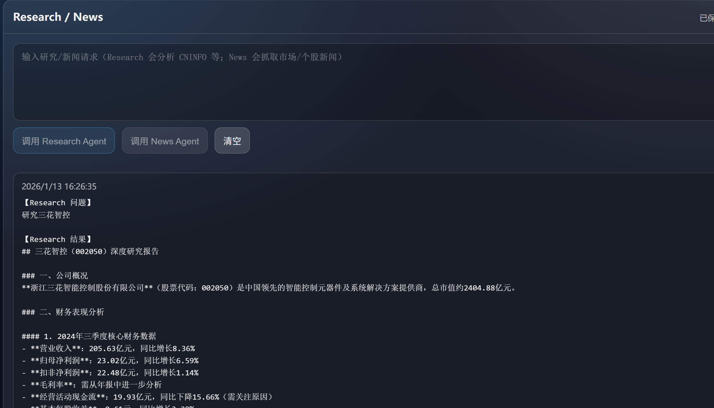

# 研究资讯使用说明：Research / News

本文档说明**研究资讯页**的使用方式：如何发起 Research 研究请求、查看结果，并与知识库文档配合使用。

**说明**：News Agent（新闻查询）功能**暂时不可用**，当前仅支持 Research Agent（研究查询）。

---

## 一、整体结构与数据流

### 1.1 页面对照

研究资讯页提供一个统一的输入框，用于：

- 提问研究类问题（走 Research Agent + 知识库）；
- 新闻查询入口保留，但 **News Agent 暂不可用**。

请求与结果会按时间倒序显示，并可在本地保存。

### 1.2 请求流概览

- **Research 请求**：系统以流式方式返回「步骤进度」与最终结果；
- 知识库会参与检索与引用，详见 [knowledge.md](detail/knowledge.md) 与 [knowledge_integration](detail/knowledge.md)。

---

## 二、Research Agent 调用

### 2.1 适用问题类型

Research Agent 用于需要**查公告、看财报、结合历史事实给出分析结论**的问题，例如：

- 某公司某年度/季度的营收、利润、现金流情况；
- 某个事件对公司基本面的影响；
- 对多个公告/文档进行综合对比与总结。

### 2.2 操作步骤

1. 在输入框中填入研究问题，例如：

   > 查询贵州茅台 2023 年年报的营收和净利润情况，并给出简要分析  

2. 点击「调用 Research Agent」按钮；
3. 页面会显示当前执行状态（如「正在连接…」「步骤 3：解析 PDF 内容」等）；
4. 完成后，在结果列表中新增一条记录：研究结论与引用信息（公告列表、PDF 链接、知识库检索结果等）。

### 2.3 与知识库的关系

Research Agent 会：

- 调用 CNINFO 工具获取公告与 PDF 链接；
- 从知识库中检索历史相关记录；
- 将新获取的重要信息写入知识库，以备后续检索。

因此：

- **多次提问同一公司/主题时**，Research Agent 可以复用已入库的信息；
- 在 [knowledge_integration](detail/knowledge.md) 中有更细的入库与检索逻辑说明。

---

## 三、News Agent（暂不可用）

News Agent 设计用于快速获取市场或个股新闻，当前**暂时不可用**，界面保留「调用 News Agent」入口。

---

## 四、结果列表与持久化

### 4.1 结果卡片

每次 Research 调用成功后，会在结果列表中新增一条卡片，包含时间戳与文本内容（请求 + 结果）。用户可通过「清空」按钮删除本地保存的记录，不影响知识库数据。

### 4.2 本地存储说明

- Research 结果可在浏览器本地保存；
- 多用户模式下按用户区分；
- 清除浏览器缓存或更换设备会导致本地记录丢失，不影响知识库与文档引用。

---

## 五、与知识库相关文档的配合

当前仓库中，研究与知识库相关的文档包括：

- [knowledge.md](detail/knowledge.md)：解释如何向知识库写入与检索信息；
- 本文档：说明如何发起 Research 请求并查看结果。
