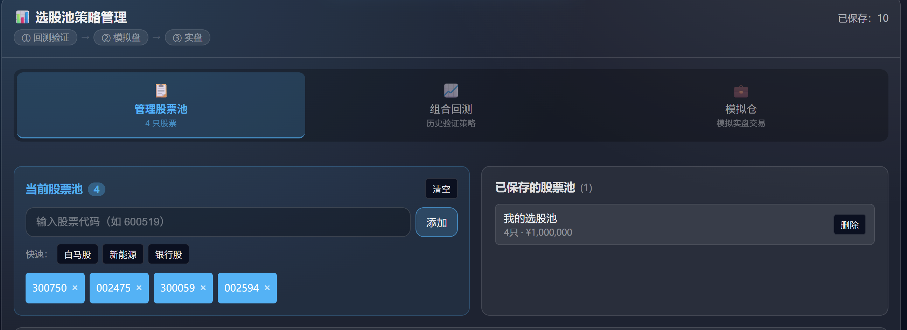
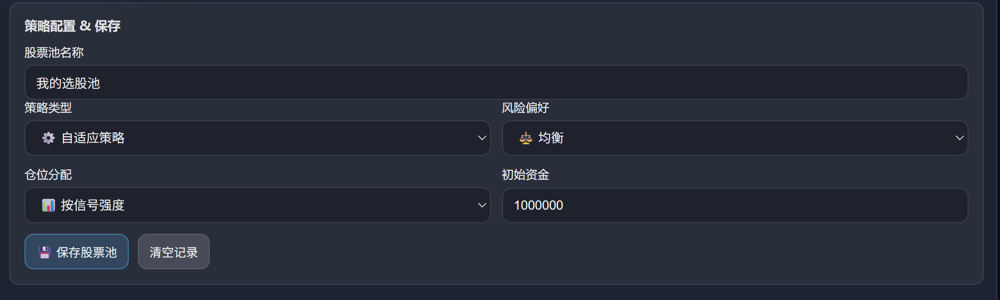
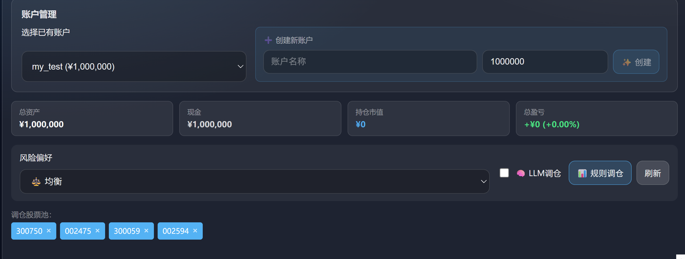
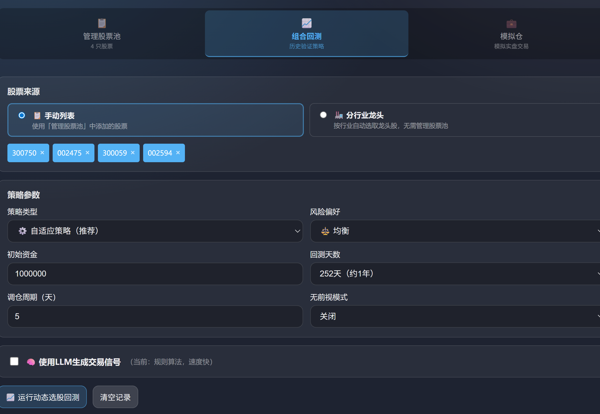
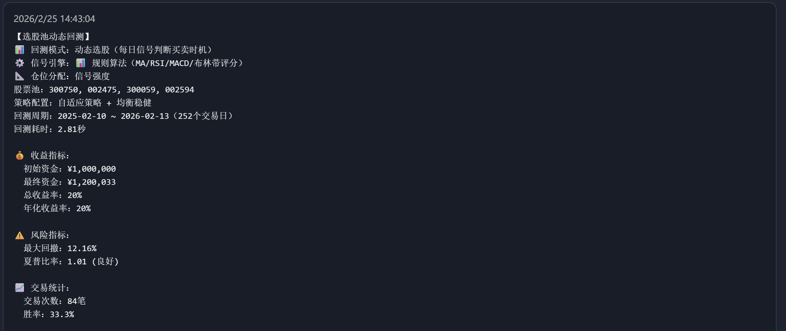

# 选股池与模拟仓：架构与使用说明

本文档说明**选股池管理、动态组合回测与股票池模拟仓**的架构、工作流与使用方法，并预留截图位置。

> **重要说明**：选股池的**组合回测未考虑滑点与手续费**，回测收益与指标为理论值；实盘或模拟仓调仓时需自行考虑交易成本。

---

## 一、整体架构与工作流

### 1.1 架构概览

```
┌──────────────────────────────────────────────────────────────┐
│              选股池页（三种模式）                             │
│  管理股票池 / 模拟仓 / 组合回测                              │
└──────────────────────────────────────────────────────────────┘
       │                    │                      │
       ▼                    ▼                      ▼
┌───────────────┐   ┌────────────────┐   ┌────────────────────────┐
│ 保存/加载池   │   │ 模拟仓账户     │   │ 动态选股 + 回测        │
└───────────────┘   └────────────────┘   └────────────────────────┘
       │                    │                      │
       ▼                    ▼                      ▼
┌───────────────────────────────────────────────────────────────┐
│  系统：选股池列表与保存、模拟仓创建与调仓、组合回测与流式进度  │
└───────────────────────────────────────────────────────────────┘
```

- **选股池管理**：维护股票列表、策略类型、风险偏好、仓位分配方式等，并保存为可复现的「策略快照」。
- **组合回测**：基于股票池与策略配置，按日生成买卖信号，动态决定哪些股票持仓、持有多久、如何加减仓。
- **模拟仓**：在单独账户内按信号或 LLM 决策执行调仓，记录持仓与交易历史。

**策略应用流程**：典型流程为 **回测 → 模拟盘 → 实盘**。本模块提供**回测**与**模拟盘**功能（实盘需依赖其他系统或人工执行）。

- **回测的动机**：在**过去**一段时间内，用历史数据模拟交易，验证策略在历史上的表现。
- **模拟盘的动机**：在**未来**一段时间内，用实时或后续数据模拟交易，在真实资金介入前观察策略表现。

### 1.2 三种模式

- `manage`：管理股票池与策略配置、保存/加载选股池。
- `sim`：选股池模拟仓：账户管理、调仓执行、交易记录查看。
- `backtest`：动态选股回测：股票来源（手动/指数/分行业龙头）+ 策略 + 风险偏好 + LLM 决策流。

### 1.3 一般使用流程

1. **先管理股票池**：在「管理」模式下手动添加股票，或加载已保存的选股池，并配置策略类型、风险偏好、仓位分配等。
2. **再选择后续操作**：进入**模拟仓**进行模拟交易，或进入**组合回测**在历史区间上验证策略。

---

## 二、选股池管理（mode = manage）

### 2.1 股票池与快捷添加

- **股票池展示区域**：始终显示当前股票池中的所有代码，可一键清空。
- **添加股票**：
  - 手动输入股票代码或名称，按回车或点击「添加」；
  - 内置「白马股」「新能源」「银行股」等快捷按钮，会向池中追加预设列表。
- **删除股票**：在标签上点击「×」移除。



### 2.2 策略配置与保存

- **核心参数**：
  - 策略类型：自适应 / 趋势跟踪 / 均值回归 / 缠论；
  - 风险偏好：激进 / 均衡 / 保守；
  - 仓位分配：按信号强度 / 等权重 / 风险平价 / 凯利公式；
  - 初始资金。
- **保存行为**：将上述配置与股票池一起保存；在「已保存的选股池」中可删除策略快照。



---

## 三、选股池模拟仓（mode = sim）

### 3.1 账户管理

- **账户列表**：加载已有模拟账户列表，可选择并刷新。
- **创建账户**：输入账户 ID（允许中文/字母/数字/下划线）、设置初始资金，使用当前股票池初始化账户。
- **删除账户**：删除后清空该账户所有数据。

### 3.2 账户信息与持仓

账户信息包括：总资产、现金、持仓市值、总盈亏与收益率、持仓数量；每只股票的持仓股数、成本价、现价、市值与浮动盈亏；最近若干笔买入/卖出记录。界面以卡片与列表形式展示。



### 3.3 调仓执行：规则 vs LLM

- **调仓入口**：
  - 选择账户；
  - 设置风险偏好；
  - 选择是否使用 LLM 调仓。
- **规则调仓**：
  - 使用技术指标信号引擎，为池内每只股票生成 Long / Short / Neutral；
  - 根据信号与风险偏好计算目标仓位；
  - 执行买卖操作，写入模拟仓记录。
- **LLM 调仓**：
  - 在规则信号基础上，调用 LLM 分析股票池整体与单票表现；
  - 让大模型给出增加/减仓建议及文字说明；
  - 根据模型建议执行调仓，并在结果中展示 LLM 分析摘要。


---

## 四、动态组合回测（mode = backtest）

### 4.1 股票来源（Universe）

动态回测支持两种股票来源：

- **手动列表**：按当前股票池中的代码回测；需先在「管理股票池」中添加股票。
- **分行业龙头**：从行业列表中选择一个或多个行业、指定每行业龙头数量，可预览龙头列表后再回测；无需管理股票池。


### 4.2 回测参数与信号引擎

- **核心参数**：
  - 初始资金、回测天数；
  - 策略类型：自适应 / 趋势 / 均值回归 / 缠论；
  - 风险偏好；
  - 无前视模式（no_lookahead）与回测起始日期；
  - 是否启用 LLM 信号（use_llm_signals）；
  - LLM 采样频率（如每 5 天调用一次）；
  - 高胜率模式（在 LLM 下使用更严格的入场条件）。
- **信号引擎**：
  - 规则模式：MA / RSI / MACD / 布林带评分，偏重一致性与可复现性；
  - LLM 模式：
    - 周期性调用大模型，为每只股票生成买卖建议与理由；
    - 支持「组合维度」的优先买/卖名单；
    - 可附加高胜率约束（多指标共振、盈亏比、追高限制等）。



### 4.3 回测结果与持仓时间线

组合回测的结果文本包括：

- 回测模式、信号引擎、仓位分配方式；
- 股票池描述（手动列表 / 指数成分 / 行业龙头）；
- 收益指标：初始资金、最终资金、总收益率、年化收益率；
- 风险指标：最大回撤、夏普比率；
- 交易统计：交易次数与胜率；
- 各股票历史盈亏与当前持仓；
- 当前持仓明细与权重。

界面会展示：回测图表（收益曲线）、交易记录表格、持仓变动时间线（每个采样日期的总值、日收益、累计收益、现金占比，以及新建仓/清仓提示、每只持仓的权重与收益率）。




---

