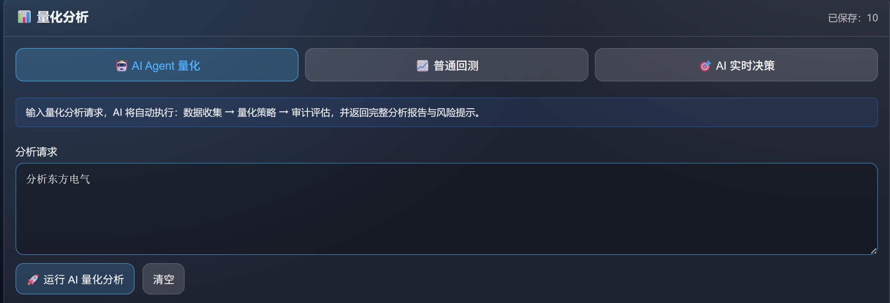
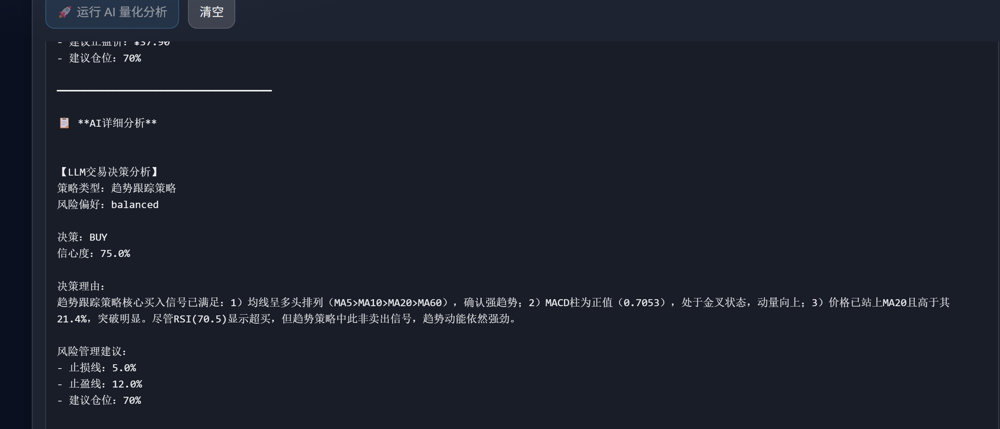
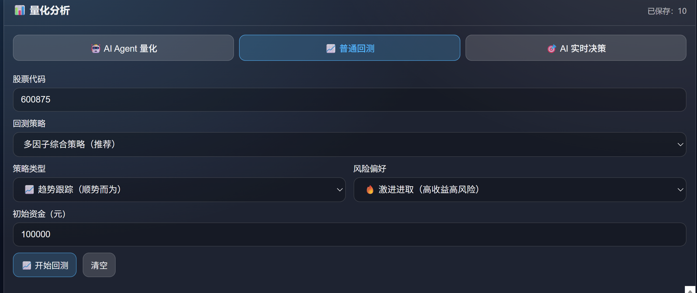
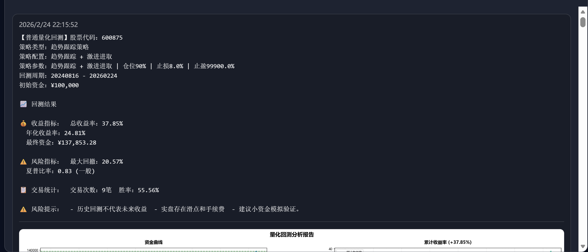

# 量化回测与 AI 决策：架构与使用说明

本文档说明**量化回测模块**：包括 AI Agent 量化、普通回测、AI 实时决策与 LLM 信号回测的整体架构、工作流与使用示例，并预留截图位置。

> **重要说明**：本模块所有回测（普通回测、LLM 信号回测、AI Agent 量化中的回测部分）**均未考虑滑点与手续费**。回测结果仅供参考，实盘表现可能因交易成本而低于回测。

---

## 一、整体架构与工作流

### 1.1 架构概览

```
┌──────────────────────────────────────────────────────────────┐
│                    量化分析页（三种模式）                     │
│  AI Agent量化 / 普通回测 / AI实时决策 + LLM回测              │
└──────────────────────────────────────────────────────────────┘
            │                         │                      │
            ▼                         ▼                      ▼
   ┌────────────────┐       ┌────────────────┐      ┌─────────────────────┐
   │ 自然语言请求   │       │ 规则策略回测   │      │ AI决策 + 策略回测   │
   └────────────────┘       └────────────────┘      └─────────────────────┘
            │                         │                      │
            ▼                         ▼                      ▼
┌───────────────────────────────────────────────────────────────────────┐
│  系统：Data_Researcher → Quant_Trader → Quant_Auditor 工作流          │
│  规则策略（双均线/MACD/RSI+布林带/多因子等）                           │
│  LLM + 技术指标 → 单次决策 或 整段回测                                │
└───────────────────────────────────────────────────────────────────────┘
```

- **AI Agent 量化**：输入自然语言请求，系统通过多 Agent 工作流完成数据收集、策略回测与审计，返回完整量化分析报告。
- **普通回测**：选择规则策略（双均线、MACD、RSI+布林带、多因子等），不使用 LLM，结果一致、可复现。
- **AI 实时决策**：在给定股票、策略类型、风险偏好与持仓信息的前提下，系统综合技术指标与 LLM 分析，输出一条面向「当下」的交易建议。
- **LLM 信号回测**：在回测区间内按一定步长由 LLM 生成买卖信号，用于评估「AI 决策」在历史行情上的表现。

### 1.2 三种模式

- **AI Agent 量化（mode = 'agent'）**
  - 输入：自然语言请求（如「对贵州茅台进行量化分析，回测多因子策略」）。
  - 输出：完整的多 Agent 分析报告，可包含每个节点的中间思考过程。
- **普通回测（mode = 'backtest'）**
  - 输入：股票代码、策略、策略类型、风险偏好、初始资金。
  - 输出：常规回测指标（总收益、年化收益、夏普、最大回撤、胜率）+ 回测图表。
- **AI 实时决策 + LLM 回测（mode = 'ai-decision'）**
  - 输入：股票代码、策略类型、风险偏好；可选传入持仓价格与持仓天数。
  - 输出：单次决策（买入/卖出/观望）与详细解释；可再触发 LLM/规则驱动的整段回测。

---

## 二、各部分说明

### 2.1 AI Agent 量化

- **入口**：量化分析页顶部模式切换 → 选择「🤖 AI Agent 量化」。
- **系统流程（概览）**：
  - 接收自然语言请求；
  - Data_Researcher 负责拉取、处理行情与财报信息；
  - Quant_Trader 设计或选择量化策略并执行回测；
  - Quant_Auditor 对策略表现与风险进行审计并给出结论。
- **结果展示**：完整的多 Agent 分析报告；若系统返回分步过程，则按节点分段展示。

**适用场景**：用「一段话说明需求」，由系统自动完成从数据采集到回测与风险评估的整条链路，适合思路探索与复盘。

### 2.2 普通回测

- **入口**：模式切换 →「📈 普通回测」。
- **可选策略**（映射自 `strategyNames`）：
  - 多因子综合策略（推荐）
  - 双均线策略（MA5/MA20）
  - MACD 策略（金叉/死叉）
  - RSI+布林带策略（超买/超卖）
  - 趋势跟踪策略
  - 均值回归策略
- **参数**：
  - 股票代码：如 `600875`；
  - 策略类型：趋势跟踪 / 均值回归 / 缠论；
  - 风险偏好：激进进取 / 均衡稳健 / 稳健保守；
  - 初始资金：默认 100000 元。

**内部流程（简化）**：根据策略类型和风险偏好生成策略参数（止损、止盈、仓位等），基于历史行情逐日计算仓位与收益，最终以指标与图表形式展示。

### 2.3 AI 实时决策

- **入口**：模式切换 →「🎯 AI 实时决策」。
- **输入参数**：股票代码；策略类型（自适应 / 趋势 / 均值回归）；风险偏好；如有持仓则填写开仓价格与持仓天数。
- **系统流程**：计算当前技术指标（MA、RSI、MACD、布林带、ATR 等），结合持仓与策略偏好交由 LLM 分析，输出决策（买入/卖出/观望）、信心度、止损止盈与建议仓位。
- **结果展示**：指标快照、决策与信心度、风险管理建议、LLM 详细分析文本。

### 2.4 LLM 信号回测 / 规则信号回测

在「AI 实时决策」模式下，还可以发起一段时间的**策略回测**：

- **规则信号回测**：不启用 LLM 信号，使用固定规则（MA/RSI/MACD/布林带）生成信号，强调一致性与可复现性。
- **LLM 信号回测**：启用 LLM 信号后，每隔若干天（可设采样频率）由 LLM 生成买卖信号；回测结果中会给出 LLM 调用次数与平均间隔。

**注意**：LLM 信号回测本质是在真实行情上尝试「AI 控盘」，用于评估多 Agent / 大模型在该策略上的实际稳定性与收益曲线，这也是本项目探索 AI Agent 与 LangGraph 工作流的一个重要实验场景。

---

## 三、完整使用示例

### 3.1 AI Agent 量化：从自然语言到完整报告

1. 切换到「📊 量化分析」页，选择模式「🤖 AI Agent 量化」；
2. 输入：
   > 对贵州茅台进行量化分析，回测多因子策略，给出策略逻辑和风险提示  
3. 点击「🚀 运行 AI 量化分析」；
4. 等待多 Agent 工作流执行完毕，在结果卡片中查看：
   - 数据收集与预处理摘要；
   - 策略设计与参数；
   - 回测指标（收益、夏普、回撤、胜率等）；
   - Quant_Auditor 给出的审计结论与风险提示。





### 3.2 普通回测：验证单一规则策略

1. 选择模式「📈 普通回测」；
2. 填写：
   - 股票代码：`600875`；
   - 回测策略：多因子综合策略；
   - 策略类型：趋势跟踪；
   - 风险偏好：均衡稳健；
   - 初始资金：100000；
3. 点击「📈 开始回测」；
4. 在结果区查看：
   - 收益指标：总收益率、年化收益率、最终资金；
   - 风险指标：最大回撤、夏普比率；
   - 回测图表（7 合 1 图或综合图表）；
   - 交易次数与胜率。





### 3.3 AI 实时决策 + LLM 回测

1. 选择模式「🎯 AI 实时决策」；
2. 填写：
   - 股票代码：`600875`；
   - 策略类型：自适应策略；
   - 风险偏好：均衡；
   - 若当前持有：勾选「当前有持仓」，输入开仓价格与持仓天数；
3. 点击「🤖 获取 AI 实时决策」；
4. 在结果中查看：
   - 当前多指标状态（均线、RSI、MACD 等）；
   - 决策（买入/卖出/观望）与信心度；
   - 止损/止盈与仓位建议；
   - LLM 的详细分析理由。
5. 如需评估策略在历史上的表现，可在同一模式下配置「回测天数」「初始资金」「是否使用 LLM 信号」后，点击「📈 运行策略回测」或「🧠 运行 LLM 回测」。

---
